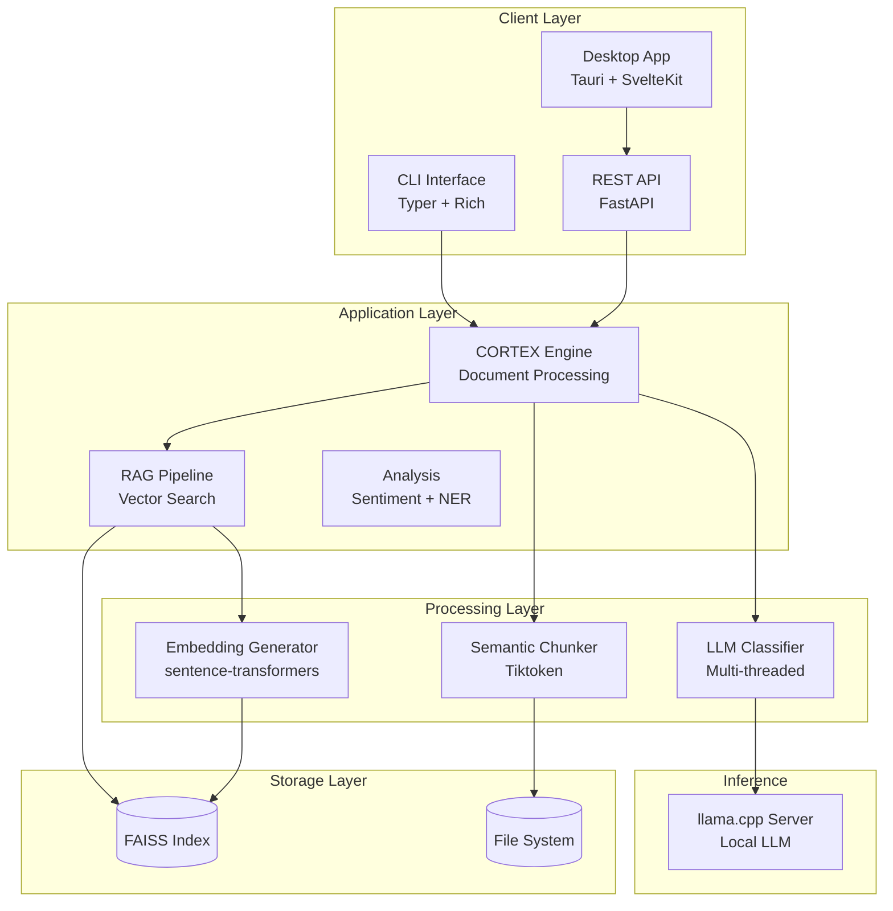

<div align="center">

# PHANTOM

```
╔══════════════════════════════════════════════════════════════════╗
║  ██████╗ ██╗  ██╗ █████╗ ███╗   ██╗████████╗ ██████╗ ███╗   ███╗ ║
║  ██╔══██╗██║  ██║██╔══██╗████╗  ██║╚══██╔══╝██╔═══██╗████╗ ████║ ║
║  ██████╔╝███████║███████║██╔██╗ ██║   ██║   ██║   ██║██╔████╔██║ ║
║  ██╔═══╝ ██╔══██║██╔══██║██║╚██╗██║   ██║   ██║   ██║██║╚██╔╝██║ ║
║  ██║     ██║  ██║██║  ██║██║ ╚████║   ██║   ╚██████╔╝██║ ╚═╝ ██║ ║
║  ╚═╝     ╚═╝  ╚═╝╚═╝  ╚═╝╚═╝  ╚═══╝   ╚═╝    ╚═════╝ ╚═╝     ╚═╝ ║
╚══════════════════════════════════════════════════════════════════╝
```

**Document Intelligence Framework**

_Semantic chunking, LLM classification, and RAG search over local documents_

[](https://github.com/kernelcore/phantom/actions/workflows/ci.yml)
[](https://www.python.org/)
[](https://github.com/astral-sh/ruff)
[](LICENSE)
[](https://nixos.org/)

[Features](#features) | [Quick Start](#quick-start) | [Architecture](#architecture) | [Contributing](CONTRIBUTING.md)

</div>

---

## What is Phantom?

Phantom processes unstructured documents (markdown, text, PDF) into structured insights. It splits text into semantic chunks, classifies them via a local LLM (llama.cpp), generates vector embeddings, and indexes them in FAISS for retrieval.

The result is a pipeline that takes a pile of documents and gives you: extracted themes, patterns, recommendations, sentiment scores, and a searchable vector index you can query with natural language.

**Design principles:**

- **Local-first** — runs entirely on your hardware via llama.cpp; no cloud API keys required for core functionality
- **Cross-platform** — targets Linux, macOS, and Windows. Development uses a Nix flake for reproducibility; distribution will include standalone binaries for each platform
- **Modular** — use individual components (chunker, embeddings, vector store) or the full pipeline
- **Resource-aware** — monitors VRAM usage and throttles processing when GPU memory is low

---

## Features

### Document Processing (CORTEX)

- Semantic chunking with tiktoken token counting and configurable overlap
- Parallel LLM classification with retry logic (thread pool)
- Insight extraction: themes, patterns, learnings, concepts, recommendations
- Pydantic validation on all extracted data

### Vector Search (RAG)

- FAISS indexing with sentence-transformers embeddings (default: `all-MiniLM-L6-v2`)
- Hybrid search: BM25 keyword + FAISS cosine similarity, fused via Reciprocal Rank Fusion
- Dense, sparse, or hybrid search modes selectable per query

### Analysis

- Sentiment analysis via NLTK VADER
- Named entity extraction (SPECTRE module)

### Resource Management

- Real-time VRAM monitoring via `nvidia-smi`
- Threshold-based auto-throttling (configurable warning/critical levels)
- System metrics endpoint: CPU, memory, disk, GPU usage

### API and Interfaces

- **REST API**: FastAPI server with Prometheus metrics, health/readiness probes
- **CLI**: Typer-based interface (currently stub implementations — see [Roadmap](#roadmap))
- **Desktop UI**: Tauri 2 + SvelteKit (framework in place, minimal UI — see [Roadmap](#roadmap))

---

## Quick Start

### Linux / macOS (Nix)

The fastest way to get a complete development environment with all dependencies pinned:

```bash
git clone https://github.com/kernelcore/phantom.git
cd phantom

nix develop          # enters reproducible dev shell

phantom version      # verify install
phantom-api          # start REST API on :8008
phantom --help       # CLI reference
```

### Linux / macOS / Windows (pip)

Works anywhere Python 3.11+ is available:

```bash
git clone https://github.com/kernelcore/phantom.git
cd phantom

python3.11 -m venv venv
source venv/bin/activate   # Windows: venv\Scripts\activate
pip install -e ".[dev]"

phantom version
phantom-api
```

> **Note:** Nix is used for development and CI. It is not required to run Phantom. Standalone binaries for Linux and macOS are planned (see [Roadmap](#roadmap)).

---

## Architecture



### Data Flow

```
Document → Semantic Chunker → [chunk₁, chunk₂, ..., chunkₙ]
                                        │
                            ┌───────────┼───────────┐
                            ▼                       ▼
                    LLM Classification      Embedding Generation
                    (llama.cpp, parallel)    (sentence-transformers)
                            │                       │
                            ▼                       ▼
                    Extracted Insights       FAISS Vector Index
                    (JSON + Pydantic)       (searchable via API)
```

### Project Structure

```
phantom/
├── src/phantom/
│   ├── core/          # CORTEX engine, embeddings, chunking
│   ├── rag/           # FAISS vector store, hybrid search
│   ├── analysis/      # Sentiment (VADER), NER, SPECTRE
│   ├── pipeline/      # Orchestration, sanitization
│   ├── providers/     # LLM providers (llama.cpp)
│   ├── cerebro/       # RAG engine + knowledge integration
│   ├── neutron/       # Compliance guardrails (SENTINEL)
│   ├── api/           # FastAPI REST server
│   └── cli/           # Typer CLI (stubs)
├── tests/
│   ├── unit/          # Unit tests
│   ├── integration/   # API + CLI integration tests
│   └── e2e/           # End-to-end pipeline tests
├── cortex-desktop/    # Tauri 2 + SvelteKit desktop app
├── intelagent/        # Rust agent (multi-crate workspace)
├── docs/              # Documentation
└── flake.nix          # Nix development environment
```

---

## Platform Support

| Platform | Status | Install method |
|----------|--------|----------------|
| Linux (x86_64) | Supported | Nix flake, pip |
| macOS (Apple Silicon / Intel) | Supported | Nix flake, pip |
| Windows | Untested | pip (should work, not yet validated) |

Planned distribution formats:

| Format | Platform | Status |
|--------|----------|--------|
| pip install | Linux, macOS, Windows | Available now |
| Nix flake | Linux, macOS | Available now |
| Standalone binary | Linux | Planned |
| Standalone binary | macOS | Planned |
| Standalone binary | Windows | Planned |
| Docker / OCI image | Linux | Planned |
| NixOS module | NixOS | Planned |

---

## Usage

### REST API

```bash
# Start server
phantom-api
# or: python -m uvicorn phantom.api.app:app --reload --host 127.0.0.1 --port 8008

# Health check
curl http://localhost:8008/health

# Extract insights from text
curl -X POST http://localhost:8008/extract \
  -H "Content-Type: application/json" \
  -d '{"content": "# My Document\n\nContent here.", "filename": "doc.md"}'

# Process uploaded file
curl -X POST http://localhost:8008/process -F "file=@report.md"

# Index a document for vector search
curl -X POST http://localhost:8008/vectors/index -F "file=@report.md"

# Semantic search
curl -X POST http://localhost:8008/vectors/search \
  -H "Content-Type: application/json" \
  -d '{"query": "security patterns", "top_k": 5, "mode": "hybrid"}'

# RAG chat
curl -X POST http://localhost:8008/api/chat \
  -H "Content-Type: application/json" \
  -d '{"message": "What is Phantom?", "conversation_id": "1", "history": []}'

# Prometheus metrics
curl http://localhost:8008/metrics
```

### Python API

```python
from phantom import CortexProcessor
from phantom.providers.llamacpp import LlamaCppProvider

# Initialize processor
processor = CortexProcessor(
    provider=LlamaCppProvider(base_url="http://localhost:8080"),
    chunk_size=1024,
    chunk_overlap=128,
    workers=4,
    enable_vectors=True,
    embedding_model="all-MiniLM-L6-v2",
    verbose=True
)

# Process document
insights = processor.process_document("document.md")

# Access extracted data
for theme in insights.themes:
    print(f"{theme.title}: {theme.description}")

# Semantic search
results = processor.search("security best practices", top_k=5)
for result in results:
    print(f"Score: {result.score:.3f} | {result.text[:100]}...")

# Save vector index
processor.save_index("./phantom_index")
```

---

## Module Reference

### `phantom.core`

- **CortexProcessor** — document processing pipeline: chunking, classification, embedding, indexing
- **EmbeddingGenerator** — sentence-transformers wrapper with batch processing
- **SemanticChunker** — markdown-aware text splitting with tiktoken token counting

### `phantom.rag`

- **FAISSVectorStore** — vector index with dense, sparse (BM25), and hybrid search modes
- **SearchResult** — typed result with distance scores and metadata

### `phantom.analysis`

- **SentimentAnalyzer** — NLTK VADER-based sentiment scoring
- **EntityExtractor** — named entity recognition (part of SPECTRE module)

### `phantom.providers`

- **LlamaCppProvider** — llama.cpp local inference (OpenAI-compatible API)

> Cloud providers (OpenAI, Anthropic) are planned but not yet implemented.
> Extend the `AIProvider` base class to add custom backends.

---

## Configuration

### Environment Variables

```bash
# LLM Provider
export PHANTOM_LLAMACPP_URL="http://localhost:8080"

# Resource Limits
export PHANTOM_VRAM_WARNING_MB=512
export PHANTOM_VRAM_CRITICAL_MB=256
export PHANTOM_MAX_WORKERS=8

# Processing
export PHANTOM_CHUNK_SIZE=1024
export PHANTOM_CHUNK_OVERLAP=128
export PHANTOM_BATCH_SIZE=10

# Embeddings
export PHANTOM_EMBEDDING_MODEL="all-MiniLM-L6-v2"
export PHANTOM_VECTOR_BACKEND="faiss"
```

---

## Development

Nix is the recommended development environment — it pins Python, native libraries, and tooling to exact versions. Contributors without Nix can use pip, but should match the Python version (3.11+) and install native dependencies (FAISS, etc.) manually.

### Running Tests

```bash
pytest                                   # all tests
pytest --cov=phantom --cov-report=html   # with coverage report
pytest tests/unit/ -v                    # unit tests only
```

Coverage minimum: 70% (enforced in CI).

### Code Quality

```bash
ruff format src/      # format
ruff check src/       # lint
mypy src/             # type check
```

---

## Roadmap

### Shipped

- [x] CORTEX processor with semantic chunking and parallel classification
- [x] FAISS vector store with hybrid BM25 + cosine search
- [x] FastAPI REST API with Prometheus metrics
- [x] CI/CD pipeline (lint, test, security scan, CodeQL, SBOM)
- [x] Nix flake development environment
- [x] pip-installable Python package
- [x] Sentiment analysis and entity extraction
- [x] System resource monitoring endpoint

### In Progress

- [ ] CLI command implementations (extract, analyze, classify, scan — currently stubs)
- [ ] Desktop app UI components (Tauri + SvelteKit framework is in place)

### Planned

- [ ] Standalone binaries for Linux (PyInstaller or Nuitka)
- [ ] Standalone binaries for macOS
- [ ] Windows validation and standalone binary
- [ ] Cloud LLM providers (OpenAI, Anthropic)
- [ ] Docker / OCI image
- [ ] NixOS module for system-level deployment
- [ ] Redis-based semantic cache

---

## Limitations

- **LLM required for classification**: classification and RAG chat need a running llama.cpp server. Without it, Phantom still chunks and indexes documents, but cannot classify or answer questions.
- **Single-node**: no distributed processing. All operations run in-process with thread pool concurrency.
- **GPU optional**: FAISS runs on CPU by default. GPU acceleration requires FAISS compiled with CUDA support.
- **CLI is incomplete**: all CLI commands currently print stub messages. Use the REST API or Python API.
- **Windows untested**: the codebase is pure Python and should work, but CI does not yet run on Windows.

---

## Contributing

Contributions are welcome. Please read:

- [CONTRIBUTING.md](CONTRIBUTING.md) — development workflow and code standards
- [CODE_OF_CONDUCT.md](CODE_OF_CONDUCT.md) — community guidelines
- [SECURITY.md](SECURITY.md) — security policy and vulnerability reporting

### Workflow

1. Fork the repository
2. Create a feature branch (`git checkout -b feature/my-feature`)
3. Make changes with tests
4. Run quality checks (`pytest && ruff check`)
5. Commit using [Conventional Commits](https://www.conventionalcommits.org/) format
6. Open a Pull Request

---

## License

Apache License 2.0 — see [LICENSE](LICENSE) for details.

---

## Acknowledgments

- [llama.cpp](https://github.com/ggerganov/llama.cpp) — local LLM inference
- [sentence-transformers](https://www.sbert.net/) — embedding models
- [FAISS](https://github.com/facebookresearch/faiss) — vector similarity search
- [Nix](https://nixos.org/) — reproducible development environments
- [FastAPI](https://fastapi.tiangolo.com/) — async web framework

---

Phantom v2.0 | Apache License 2.0
