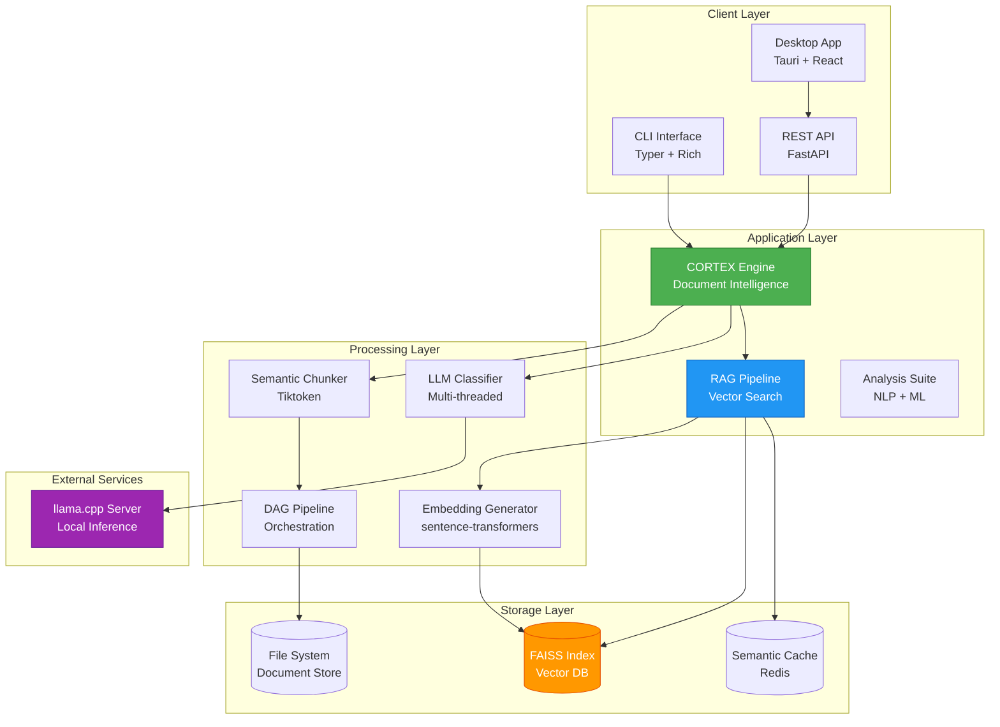
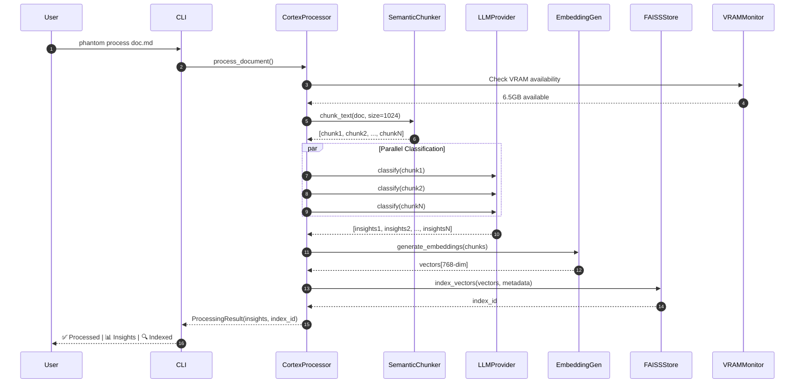
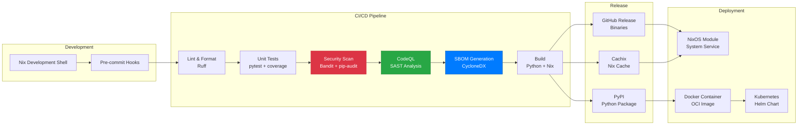
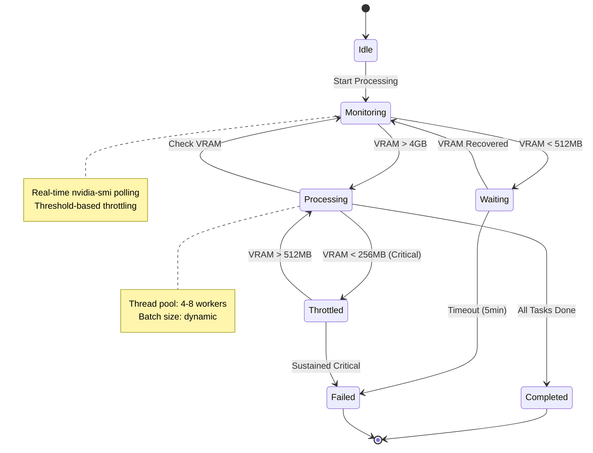

<div align="center">

# PHANTOM

```
╔══════════════════════════════════════════════════════════════════╗
║  ██████╗ ██╗  ██╗ █████╗ ███╗   ██╗████████╗ ██████╗ ███╗   ███╗ ║
║  ██╔══██╗██║  ██║██╔══██╗████╗  ██║╚══██╔══╝██╔═══██╗████╗ ████║ ║
║  ██████╔╝███████║███████║██╔██╗ ██║   ██║   ██║   ██║██╔████╔██║ ║
║  ██╔═══╝ ██╔══██║██╔══██║██║╚██╗██║   ██║   ██║   ██║██║╚██╔╝██║ ║
║  ██║     ██║  ██║██║  ██║██║ ╚████║   ██║   ╚██████╔╝██║ ╚═╝ ██║ ║
║  ╚═╝     ╚═╝  ╚═╝╚═╝  ╚═╝╚═╝  ╚═══╝   ╚═╝    ╚═════╝ ╚═╝     ╚═╝ ║
╚══════════════════════════════════════════════════════════════════╝
```

**Living Machine Learning Framework**

_Production-grade document intelligence, RAG pipeline, and AI classification system_

[](https://github.com/kernelcore/phantom/actions/workflows/ci.yml)
[](https://www.python.org/)
[](https://github.com/astral-sh/ruff)
[](LICENSE)
[](https://nixos.org/)

[Features](#features) | [Quick Start](#quick-start) | [Architecture](#architecture) | [Contributing](CONTRIBUTING.md)

</div>

---

## 🏗️ System Architecture

### High-Level Component Diagram



### Data Flow - Document Processing Pipeline



### Deployment Architecture



### State Machine - Resource Management



---

## What is Phantom?

Phantom is a **living ML framework** that transforms unstructured documents into actionable intelligence. Built on a foundation of semantic chunking, vector embeddings, and parallel LLM inference, Phantom provides production-ready tools for document classification, insight extraction, and RAG-powered question answering.

### Core Philosophy

- **Living Framework**: Continuously evolving components that adapt to your data
- **Local-First**: Runs entirely on your infrastructure with llama.cpp
- **Declarative**: Fully reproducible Nix-based environment
- **Production-Grade**: VRAM monitoring, resource throttling, parallel processing
- **Modular**: Use individual components or the complete pipeline

---

## Architecture

```
┌─────────────────────────────────────────────────────────────────┐
│ PHANTOM v2.0                                                    │
│ Living ML Framework Pipeline                                    │
└─────────────────────────────────────────────────────────────────┘
                              │
        ┌───────────────┼───────────────┐
        │               │               │
  ┌─────▼─────┐   ┌────▼────┐   ┌─────▼──────┐
  │   CORE    │   │   RAG   │   │  ANALYSIS  │
  ├───────────┤   ├─────────┤   ├────────────┤
  │  Cortex   │   │ Vectors │   │ Sentiment  │
  │ Chunking  │   │  FAISS  │   │  Entities  │
  │Embeddings │   │ Search  │   │   Topics   │
  └─────┬─────┘   └────┬────┘   └─────┬──────┘
        │              │              │
        └──────┬───────┴──────┬───────┘
               │              │
        ┌──────▼──────┐ ┌────▼────────┐
        │  PIPELINE   │ │  PROVIDERS  │
        ├─────────────┤ ├─────────────┤
        │  DAG Exec   │ │ llama.cpp   │
        │ Classifier  │ │ (local)     │
        │ Sanitizer   │ └─────────────┘
        └──────┬──────┘
               │
        ┌──────┴──────┬──────────┐
        │             │          │
   ┌────▼─────┐ ┌────▼─────┐
   │   CLI    │ │   API    │
   ├──────────┤ ├──────────┤
   │  Typer   │ │ FastAPI  │
   │ Rich UI  │ │   REST   │
   └──────────┘ └──────────┘
```

---

## Features

### Document Intelligence (CORTEX)

- **Semantic Chunking**: Intelligent text splitting that preserves context
- **Parallel Classification**: Multi-threaded LLM inference with retry logic
- **Insight Extraction**: Themes, patterns, learnings, concepts, recommendations
- **Pydantic Validation**: Strict schema enforcement for all extracted data

### RAG Pipeline

- **Vector Embeddings**: sentence-transformers with local inference
- **FAISS Indexing**: Blazing-fast similarity search (CPU/GPU)
- **Semantic Caching**: Reduce redundant computations
- **Hybrid Search**: Combine vector and keyword search

### Resource Management

- **VRAM Monitoring**: Real-time GPU memory tracking via nvidia-smi
- **Auto-Throttling**: Pause processing when resources are low
- **Parallel Execution**: ThreadPool-based concurrent processing
- **Progress Tracking**: Rich terminal UI with live updates

### Production Features

- **Declarative Environment**: Fully reproducible Nix flake
- **Type Safety**: Complete Pydantic models for all data structures
- **API Server**: FastAPI REST endpoints with async support
- **CLI Interface**: Feature-rich Typer CLI with beautiful output
- **Testing**: Comprehensive pytest suite

---

## Quick Start

### NixOS (Recommended)

```bash
git clone https://github.com/kernelcore/phantom.git
cd phantom

nix develop          # enters reproducible dev shell

phantom version      # verify install
phantom-api          # start REST API on :8000
phantom --help       # full CLI reference
```

### Standard Python

```bash
python3.11 -m venv venv
source venv/bin/activate
pip install -e ".[dev]"

phantom version
```

---

## Usage

### CLI

```bash
# Extract insights from a document
phantom extract -i ./docs -o output.jsonl

# Analyze a single file
phantom analyze report.md --sentiment --entities

# Classify files in a directory
phantom classify ./input --dry-run

# Scan for sensitive data
phantom scan ./project

# RAG pipeline
phantom rag query "What are the security patterns?"
phantom rag ingest ./knowledge

# Start API server
phantom api serve --host 127.0.0.1 --port 8000 --reload
```

### Python API

```python
from phantom import CortexProcessor
from phantom.providers.llamacpp import LlamaCppProvider

# Initialize processor
processor = CortexProcessor(
    provider=LlamaCppProvider(base_url="http://localhost:8080"),
    chunk_size=1024,
    chunk_overlap=128,
    workers=4,
    enable_vectors=True,
    embedding_model="all-MiniLM-L6-v2",
    verbose=True
)

# Process document
insights = processor.process_document("document.md")

# Access extracted data
for theme in insights.themes:
    print(f"{theme.title}: {theme.description}")

# Semantic search
results = processor.search("security best practices", top_k=5)
for result in results:
    print(f"Score: {result.score:.3f} | {result.text[:100]}...")

# Save vector index
processor.save_index("./phantom_index")
```

### REST API

```bash
# Start server
phantom api serve

# Health check
curl http://localhost:8000/health

# Extract insights
curl -X POST http://localhost:8000/extract \
  -H "Content-Type: application/json" \
  -d '{"content": "# My Document\n\nContent here.", "filename": "doc.md"}'

# Upload file
curl -X POST http://localhost:8000/upload -F "file=@report.md"

# RAG query
curl "http://localhost:8000/rag/query?question=What+is+Phantom?"

# Judge bundle (AI-OS-Agent integration)
curl -X POST http://localhost:8000/judge \
  -H "Content-Type: application/json" \
  -d '{"timestamp": "2026-02-04T00:00:00Z", "hostname": "host", "metrics": {}, "alerts": [], "logs": []}'
```

---

## Module Reference

### `phantom.core`

**CortexProcessor** - Main intelligence engine

- Semantic chunking with tiktoken
- Parallel LLM classification
- FAISS vector indexing
- Resource monitoring

**EmbeddingGenerator** - Vector embeddings

- sentence-transformers models
- Batch processing
- GPU acceleration support

**SemanticChunker** - Intelligent text splitting

- Markdown-aware splitting
- Token counting with tiktoken
- Configurable overlap

### `phantom.rag`

**FAISSVectorStore** - Vector database

- CPU/GPU FAISS support
- Metadata filtering
- Persistence to disk

**SearchResult** - Typed search results

- Distance scores
- Metadata extraction
- Ranking utilities

### `phantom.analysis`

**SentimentAnalyzer** - Sentiment detection
**EntityExtractor** - Named entity recognition
**TopicModeler** - LDA topic modeling

### `phantom.pipeline`

**DAGPipeline** - Directed acyclic graph execution
**FileClassifier** - Document classification
**DataSanitizer** - PII removal and sanitization

### `phantom.providers`

**LlamaCppProvider** - llama.cpp local inference (TURBO)

> Cloud providers (OpenAI, Anthropic, DeepSeek) are planned.
> Extend `AIProvider` base class to add custom backends.

---

## Configuration

### Environment Variables

```bash
# LLM Provider
export PHANTOM_LLAMACPP_URL="http://localhost:8080"
export PHANTOM_OPENAI_API_KEY="sk-..."

# Resource Limits
export PHANTOM_VRAM_WARNING_MB=512
export PHANTOM_VRAM_CRITICAL_MB=256
export PHANTOM_MAX_WORKERS=8

# Processing
export PHANTOM_CHUNK_SIZE=1024
export PHANTOM_CHUNK_OVERLAP=128
export PHANTOM_BATCH_SIZE=10

# Embeddings
export PHANTOM_EMBEDDING_MODEL="all-MiniLM-L6-v2"
export PHANTOM_VECTOR_BACKEND="faiss"
```

### NixOS Development

```bash
# All dependencies are declared in flake.nix
cd phantom && nix develop   # enters the dev shell

# Build the package
nix build .#phantom
nix run .#phantom -- --help
```

---

## Development

### Project Structure

```
phantom/
├── src/phantom/
│   ├── core/          # CORTEX engine, embeddings, chunking
│   ├── rag/           # Vector stores (FAISS), search
│   ├── analysis/      # Sentiment, SPECTRE, viability
│   ├── pipeline/      # DAG orchestration, classification, sanitization
│   ├── providers/     # LLM providers (llama.cpp)
│   ├── cerebro/       # RAG engine + knowledge integration
│   ├── neutron/       # Compliance guardrails (SENTINEL)
│   ├── api/           # FastAPI REST server + Judge API
│   └── cli/           # Typer CLI interface
├── tests/
│   ├── unit/          # Unit tests
│   ├── integration/   # API + CLI integration tests
│   └── e2e/           # End-to-end pipeline tests
├── .archive/          # Dead code + experimental (audited)
├── intelagent/        # Rust agent (part of ai-agent-os ecosystem)
├── docs/              # Documentation
└── flake.nix          # Reproducible Nix environment
```

### Running Tests

```bash
# Run all tests
pytest

# With coverage
pytest --cov=phantom --cov-report=html

# Specific module
pytest tests/test_cortex.py -v
```

### Code Quality

```bash
# Format code
ruff format src/

# Lint
ruff check src/

# Type checking
mypy src/
```

---

## Roadmap

### Current (Phase 0–4)
- [x] Critical import fixes and dead code cleanup
- [x] Dependency audit and version pinning
- [x] Test structure: unit / integration / e2e
- [x] CI/CD pipeline (lint, test, security scan, release)
- [ ] Coverage target: 70% across all modules

### Upcoming
- [ ] Cloud providers (OpenAI, Anthropic, DeepSeek)
- [ ] Full CLI command implementations (extract, analyze, classify)
- [ ] RAG query and ingestion pipeline
- [ ] Desktop app (GTK4 — archived, revisit later)
- [ ] Docker + NixOS module packaging
- [ ] Prometheus metrics endpoint (`/metrics`)

---

## Contributing

Contributions are welcome! Please read our guidelines:

- [CONTRIBUTING.md](CONTRIBUTING.md) - Development workflow and code standards
- [CODE_OF_CONDUCT.md](CODE_OF_CONDUCT.md) - Community guidelines
- [SECURITY.md](SECURITY.md) - Security policy and vulnerability reporting

### Development Workflow

1. Fork repository
2. Create feature branch (`git checkout -b feature/amazing-feature`)
3. Make changes with tests
4. Run quality checks (`pytest && ruff check`)
5. Commit (`git commit -m 'Add amazing feature'`)
6. Push (`git push origin feature/amazing-feature`)
7. Open Pull Request

---

## License

MIT License - see [LICENSE](LICENSE) for details.

---

## Acknowledgments

- **llama.cpp**: Fast LLM inference
- **sentence-transformers**: Local embedding models
- **FAISS**: Efficient similarity search
- **Nix**: Reproducible environments
- **FastAPI**: Modern Python web framework

---

## Support

- **Documentation**: [docs/](docs/)
- **Security**: [SECURITY.md](SECURITY.md)
- **Contributing**: [CONTRIBUTING.md](CONTRIBUTING.md)

---

Phantom v2.0 | NixOS + llama.cpp | MIT License
