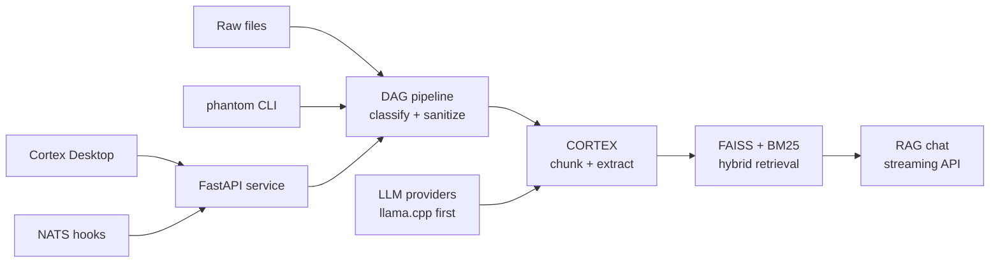

<h1 align="center">PHANTOM</h1>

<p align="center">
  <strong>Local-first document intelligence for private data pipelines.</strong>
  <br />
  Classify, sanitize, index, and query unstructured data without sending it to a cloud by default.
</p>

<p align="center">
  <a href="https://github.com/VoidNxSEC/phantom/actions/workflows/nix-build.yml"></a>
  <a href="https://github.com/VoidNxSEC/phantom/actions/workflows/nix-check.yml"></a>
  <a href="https://github.com/VoidNxSEC/phantom/actions/workflows/secret-scan.yml"></a>
  
  
  <a href="LICENSE"></a>
</p>

<p align="center">
  <a href="#quickstart">Quickstart</a>
  · <a href="#architecture-tour">Architecture</a>
  · <a href="#core-capabilities">Capabilities</a>
  · <a href="#runtime-surfaces">Runtime</a>
  · <a href="#development">Development</a>
  · <a href="docs/architecture/project_topology.rst">Topology</a>
</p>

---

Phantom turns messy folders of documents, logs, configs, and code into structured
intelligence: searchable chunks, sensitivity findings, sanitized exports,
RAG-ready vector indexes, and audit-friendly processing reports.

It is built for operators who care about data boundaries. The default path is
local inference through `llama.cpp`, local vector search with FAISS/BM25, and a
reproducible Nix development environment. Cloud providers can be added through
the provider abstraction, but the core workflow does not require them.

> Data stays local. Search gets smarter. Operators keep control.

## Why Phantom

| Need | Phantom gives you |
| --- | --- |
| Keep private data local | Local-first processing, `llama.cpp` provider, no cloud dependency by default |
| Understand large document sets | CORTEX chunking, embeddings, insight extraction, and RAG chat |
| Prepare data safely | DAG classification, PII detection, pseudonymization, sanitization, quarantine |
| Search beyond keywords | Hybrid retrieval with FAISS dense search plus BM25 sparse search |
| Operate like a real system | Typer CLI, FastAPI service, Prometheus metrics, Nix, Docker, tests |
| Give users a GUI | Cortex Desktop, a Tauri 2 + SvelteKit client for the local API |

## Architecture Tour



```text
phantom/
├── src/phantom/        # Python runtime: CLI, FastAPI, CORTEX, RAG, DAG, providers
├── cortex-desktop/     # Tauri 2 + SvelteKit desktop client
├── intelagent/         # Rust agent and quality-gate primitives
├── spectre/            # Companion signal/pattern extraction scaffold
├── nix/ + flake.nix    # Reproducible development, packages, and checks
├── docs/               # Architecture, guides, deployment notes, history
├── arch/               # Generated architecture reports
├── tests/              # Unit, integration, and e2e tests
└── .archive/           # Historical experiments and dead-code snapshots
```

For the canonical topology map, see
[docs/architecture/project_topology.rst](docs/architecture/project_topology.rst).

## Quickstart

Phantom is happiest inside its pinned Nix shell.

```bash
git clone https://github.com/VoidNxSEC/phantom
cd phantom

nix develop
just test
just serve
```

Then check the API:

```bash
curl http://localhost:8008/health
```

Run the desktop client:

```bash
just desktop
```

Use the CLI directly:

```bash
phantom scan ./documents
phantom classify ./documents --dry-run
phantom rag ingest ./docs --collection local
phantom rag query "What are the main compliance risks?" --collection local
```

## Core Capabilities

### CORTEX Document Engine

CORTEX splits large inputs into semantic chunks, embeds them locally, and
extracts structured insights through an LLM provider.

```text
Document -> SemanticChunker -> EmbeddingGenerator -> LLM Provider -> Pydantic schema
```

It is designed for long documents, bounded context windows, and GPU-aware local
inference.

### Hybrid Vector Search

Phantom combines dense semantic search with sparse keyword retrieval.

```text
Query -> FAISS cosine search ----+
                                 +-> Reciprocal Rank Fusion -> ranked results
Query -> BM25 keyword search ----+
```

Index and search through HTTP:

```bash
curl -X POST http://localhost:8008/vectors/index \
  -F "file=@docs/architecture/CORTEX_V2_ARCHITECTURE.md"

curl -X POST http://localhost:8008/vectors/search \
  -H "Content-Type: application/json" \
  -d '{"query": "semantic chunking tradeoffs", "top_k": 5, "mode": "hybrid"}'
```

### Streaming RAG Chat

```bash
curl -N -X POST http://localhost:8008/api/chat/stream \
  -H "Content-Type: application/json" \
  -d '{
    "message": "Summarize the indexed architecture decisions.",
    "conversation_id": "demo",
    "history": [],
    "context_size": 5
  }'
```

### Sanitization and Chain of Custody

The DAG pipeline classifies files, detects sensitive patterns, optionally
sanitizes content, records fingerprints, and isolates suspicious outputs.

| Stage | Purpose |
| --- | --- |
| Discover | Walk input trees and prepare file records |
| Fingerprint | Capture SHA256, BLAKE3, xxHash, size, and timestamps |
| Classify | Detect document, code, data, config, log, crypto, media, and unknown files |
| Detect | Find PII, secrets, keys, tokens, network indicators, and identifiers |
| Sanitize | Strip metadata, redact PII, or perform full sanitization |
| Persist | Write audit records, reports, outputs, and quarantine entries |

## Runtime Surfaces

| Surface | Entry point | What it owns |
| --- | --- | --- |
| CLI | `phantom` | Extraction, analysis, classification, scans, RAG, tools, API startup |
| API | `phantom-api` / `just serve` | Health, metrics, upload, process, vector, chat, pipeline, judge endpoints |
| Desktop | `just desktop` | Tauri/Svelte GUI for local workflows |
| Nix | `nix develop`, `nix build`, `nix flake check` | Reproducible shell, packages, and checks |
| Docker | `Dockerfile` | OCI fallback for non-Nix environments |
| IntelAgent | `intelagent/` | Rust agent abstractions and quality-gate primitives |

## API Snapshot

The FastAPI server exposes OpenAPI docs at `/docs` when running.

| Area | Endpoints |
| --- | --- |
| Health | `GET /health`, `GET /ready`, `GET /metrics`, `GET /api/system/metrics` |
| Documents | `POST /extract`, `POST /process`, `POST /upload`, `POST /api/upload` |
| Vectors | `POST /vectors/index`, `POST /vectors/batch-index`, `POST /vectors/search` |
| Chat | `POST /api/chat`, `POST /api/chat/stream`, `GET /api/models`, `POST /api/prompt/test` |
| Pipeline | `POST /api/pipeline`, `POST /api/pipeline/scan` |
| Integrations | `GET /rag/query`, `POST /judge` |

## Development

```bash
nix develop          # enter the pinned shell
just                 # list available recipes
just lint            # ruff + mypy
just fmt             # ruff format
just test            # pytest
just test-cov        # pytest with coverage report
just ci              # lint + tests
just check           # nix flake checks
just stats           # project statistics
```

Useful focused commands:

```bash
just test-file tests/unit/test_vector_store.py
just test-match "rag"
just ruff-fix
just audit
```

## Documentation

| Document | Purpose |
| --- | --- |
| [Project Topology](docs/architecture/project_topology.rst) | Canonical map of live code, docs, generated reports, and archive areas |
| [CORTEX Architecture](docs/architecture/CORTEX_V2_ARCHITECTURE.md) | Chunking, embeddings, vector storage, retrieval, and VRAM notes |
| [Roadmap](docs/guides/ROADMAP.md) | Shipped, active, and planned work |
| [Deployment](docs/DEPLOYMENT.md) | Deployment notes for production surfaces |
| [Desktop Setup](docs/development/CORTEX_DESKTOP_SETUP.md) | Cortex Desktop development setup |
| [Security Policy](SECURITY.md) | Vulnerability reporting and security process |

## Current Status

| Component | Status |
| --- | --- |
| Python CLI and core package | Live |
| FastAPI service and metrics | Live |
| CORTEX chunking and extraction | Live |
| FAISS/BM25 retrieval | Live |
| DAG classification and sanitization | Live |
| Cortex Desktop | Beta |
| IntelAgent Rust workspace | Scaffolded |
| Cloud LLM providers | Planned |
| Redis semantic cache | Planned |
| Helm/Kubernetes packaging | Planned |

## Roadmap

Near-term work:

- Finish desktop sub-components and frontend test infrastructure.
- Add a system metrics dashboard tab wired to `/api/system/metrics`.
- Implement markdown/code rendering in chat.
- Add Redis or in-memory semantic caching for repeated embeddings and queries.
- Expand provider implementations beyond the current `llama.cpp` path.

Longer-term work:

- Standalone Linux/macOS binaries.
- Docker/OCI hardening.
- NixOS module for system-level deployment.
- Distributed and multi-node processing.
- IntelAgent advanced governance, memory, quality, MCP, and ZK features.

## Security

Phantom is designed for sensitive local workloads, but it is still alpha-stage
software. Treat it as an operator tool, review outputs before production use,
and keep test datasets separate from regulated production data until your own
controls are in place.

Found a vulnerability? See [SECURITY.md](SECURITY.md).

## License

Apache 2.0. See [LICENSE](LICENSE).

## Contributing

Read [CONTRIBUTING.md](CONTRIBUTING.md) before opening a PR. For architecture
changes or significant API modifications, open an issue with the proposed
design and the affected runtime surfaces.
