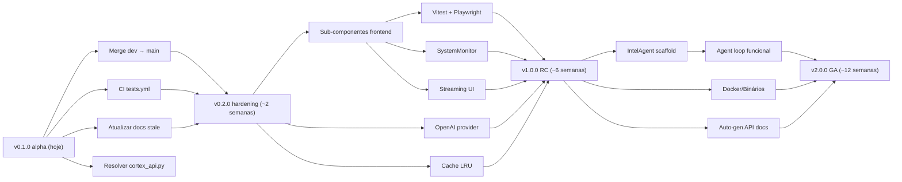

# PHANTOM — Roadmap Map (verified)

> Mapa completo do roadmap, reconciliado com a realidade do código em **2026-05-14**.
> Fontes: `docs/guides/ROADMAP.md` (2026-03-25), `ADR-0017` (monorepo), `ADR-0018` (sprint backlog), `IMPLEMENTATION_STATUS.md`, e auditoria direta do filesystem (ver `PROJECT_STATE.md`).
>
> **Atenção**: o `ROADMAP.md` oficial marca itens como "Shipped" que **não existem no working tree** (IntelAgent). Esses ficam marcados aqui como ⚠️ FANTASMA.

---

## 0. Visão de 30 segundos

```
v0.1.0 (alpha)  ──>  v0.2.0 (hardening)  ──>  v1.0.0 (RC)  ──>  v2.0.0 (GA)
   HOJE              ~2 semanas              ~6 semanas        ~12 semanas

   ✅ Backend         🎯 CI tests             🎯 Frontend       🎯 IntelAgent
   ✅ CLI             🎯 Docs consistentes    components        🎯 Cache layer
   ✅ Desktop tabs    🎯 Cloud providers       🎯 Frontend       🎯 Streaming end-to-end
   ✅ DAG pipeline    🎯 dev → main           tests             🎯 Distribuição
   ✅ FAISS hybrid    🎯 Cortex API limbo     🎯 SystemMonitor   (binários/Docker)
```

---

## 1. Mapa visual (4 tracks)

```mermaid
graph TB
  subgraph BACKEND["Backend Python — 95% completo"]
    B1[✅ CORTEX engine]
    B2[✅ FAISS + RAG]
    B3[✅ 17 endpoints REST]
    B4[✅ 11 comandos CLI]
    B5[✅ DAG pipeline]
    B6[🟡 Cortex API limbo]
    B7[🟡 Cloud providers]
    B8[🔴 Cache layer]
  end

  subgraph FRONTEND["Frontend (Cortex Desktop) — 60% completo"]
    F1[✅ Tauri 2 + Svelte 5]
    F2[✅ 6 tabs decompostos]
    F3[✅ Estado centralizado]
    F4[🟡 Sub-componentes]
    F5[🔴 Vitest + Playwright]
    F6[🔴 SystemMonitor tab]
    F7[🔴 Streaming UI real]
  end

  subgraph AGENT["IntelAgent (Rust) — 0% real"]
    A1[⚠️ Marcado como shipped mas dir não existe]
    A2[🔴 Scaffold do workspace]
    A3[🔴 Agent + Task + Quality traits]
    A4[🔴 SOC kernel]
    A5[🔴 ZK/DAO/MCP]
  end

  subgraph INFRA["Infra & Qualidade — 70% completo"]
    I1[✅ Nix flake]
    I2[✅ Pre-commit hooks]
    I3[✅ 8 workflows Nix]
    I4[🔴 CI Python tests]
    I5[🔴 Docs auto-gen]
    I6[🔴 Docker/OCI]
    I7[🔴 Standalone binários]
  end

  B7 -.-> F7
  B8 -.-> F1
  A3 --> A4 --> A5
  F4 --> F5
  F4 --> F6
  I4 --> RELEASE[v0.2.0 hardening]
  F5 --> RC[v1.0.0 RC]
  A3 --> GA[v2.0.0 GA]
```



---

## 2. Reconciliação: ROADMAP.md vs realidade

### O que o `docs/guides/ROADMAP.md` afirma já estar shipped, validado:

| Item                                                          | Realidade            |
|---------------------------------------------------------------|----------------------|
| Project reorganization (`src/phantom/`)                       | ✅ Confirmado         |
| CI/CD pipeline (lint, test, security, CodeQL, SBOM)           | ⚠️ Parcial — 8 workflows mas **nenhum roda pytest**. CodeQL/SBOM não visíveis. |
| Pre-commit hooks (ruff, mypy, bandit)                         | ✅ `.pre-commit-config.yaml` existe |
| CORTEX v2.0 (semantic chunking, embeddings, parallel class)   | ✅ `core/cortex.py` 783 LOC + `pipeline/phantom_dag.py` |
| FAISS hybrid (BM25 + cosine, RRF)                             | ✅ `rag/vectors.py` 483 LOC |
| FastAPI REST API (22 endpoints) com Prometheus                | ⚠️ **17 endpoints** em `app.py` (doc diz 22 — provável contagem incluindo cortex_api.py órfão) |
| Sentiment + SPECTRE                                           | ✅ `spectre.py` 2.265 LOC + `sentiment_analysis.py` |
| System resource monitoring endpoint                           | ✅ `/api/system/metrics` |
| pip-installable                                               | ✅ `pyproject.toml` |
| Nix flake                                                     | ✅ |
| Test coverage 70%+ enforced in CI                             | ⚠️ Enforced em `pytest.ini`, mas **CI não chama pytest** |
| CLI fully functional                                          | ✅ 11 comandos reais |
| DAG pipeline via REST                                         | ✅ `/api/pipeline` + `/api/pipeline/scan` |
| SSE streaming chat (`/api/chat/stream`)                       | ✅ Endpoint existe em `app.py:783` |
| RAG ingest/query CLI                                          | ✅ `phantom rag {ingest,query}` |
| Cortex Desktop: Tauri 2 + SvelteKit 5 + Svelte 5              | ✅ |
| Cortex Desktop: 6 tabs decompostos                            | ✅ ChatTab, ProcessTab, SearchTab, WorkbenchTab, LibraryTab, SettingsTab |
| Cortex Desktop: state.svelte.ts 320 LOC                       | ✅ Verificado |
| Cortex Desktop: typed API client + Vite proxy                 | ✅ `lib/api.ts` 89 LOC |
| Cortex Desktop: Catppuccin Mocha                              | ✅ (não rodei a UI, mas batch de tailwind config sugere) |
| Cortex Desktop: streaming chat integration                    | ⚠️ Há endpoint, mas precisa verificar se o front consome real-time (ADR-0018 P5 sugere que não) |
| **IntelAgent core abstractions**                              | ❌ ⚠️ FANTASMA — `intelagent/` não existe no working tree |
| **IntelAgent SOC kernel**                                     | ❌ ⚠️ FANTASMA — idem |

### O que o `ROADMAP.md` chama de "In Progress" / "Planned" mas a realidade indica:

| Item                                            | Status real                                  |
|-------------------------------------------------|----------------------------------------------|
| Frontend sub-components (MessageBubble, etc.)   | 🔴 Não iniciados                              |
| Frontend test infrastructure                    | 🔴 Não iniciado                               |
| System metrics dashboard tab                    | 🔴 Não iniciado                               |
| Markdown rendering + syntax highlight in chat   | 🔴 Não verificado — provavelmente não         |
| IntelAgent crates restantes                     | 🔴 N/A — nem o scaffold base existe           |
| Cache layer (in-mem/Redis)                      | 🔴 Não iniciado (`core/cache.py` não existe)  |
| Standalone binaries                             | 🔴 Não iniciado                               |
| Docker / OCI image                              | 🔴 Não iniciado                               |
| Cloud providers (OpenAI, Anthropic, DeepSeek)   | 🟡 Anthropic + DeepSeek **em `dev`** (commit `45d74fb`), OpenAI ainda 0% |
| Windows validation                              | 🔴 Não iniciado                               |
| NixOS module                                    | 🟡 Diretório `nix/` existe, validar conteúdo  |
| IntelAgent ZK/DAO/MCP                           | 🔴 Bloqueado por scaffold inexistente         |
| Distribuído / multi-node                        | 🔴 Não iniciado                               |

---

## 3. Tracks detalhadas

### TRACK A — Backend Python

**Estado**: 95% completo. Único gargalo é o limbo do `cortex_api.py` + cloud providers ainda em branch dev.

| Item                                        | Status | Arquivo                                   |
|---------------------------------------------|--------|-------------------------------------------|
| CORTEX engine (chunking + insights)         | ✅      | `core/cortex.py` (783 LOC)                |
| Embeddings (sentence-transformers)          | ✅      | `core/embeddings.py` (130) + `rag/cortex_embeddings.py` (464) |
| FAISS vector store (hybrid)                 | ✅      | `rag/vectors.py` (483)                    |
| Chunker (semantic + recursive)              | ✅      | `rag/cortex_chunker.py` (432)             |
| Sentiment (NLTK VADER + spaCy)              | ✅      | `analysis/sentiment_analysis.py` (152)    |
| SPECTRE (entity extraction)                 | ✅      | `analysis/spectre.py` (2.265)             |
| Viability scoring                           | ✅      | `analysis/viability_scorer.py` (864)      |
| AI analyzer                                 | ✅      | `analysis/ai_analyzer.py` (794)           |
| Latency optimizer                           | ✅      | `analysis/latency_optimizer.py` (216)     |
| DAG pipeline                                | ✅      | `pipeline/phantom_dag.py` (1.666)         |
| LlamaCpp provider                           | ✅      | `providers/llamacpp.py` (156)             |
| Anthropic provider                          | 🟡     | em `origin/dev`, commit `45d74fb`         |
| DeepSeek provider                           | 🟡     | em `origin/dev`, commit `45d74fb`         |
| OpenAI provider                             | 🔴     | não existe                                 |
| NATS publisher/consumer/scanner             | ✅      | `nats/` (455 LOC)                         |
| Cerebro RAG engine                          | ✅      | `cerebro/rag_engine.py` (274)             |
| Neotron Sentinel + Oracle                   | ✅      | `neotron/sentinel_integration.py` (427) + `oracle_explainer.py` (356) |
| 17 endpoints REST                           | ✅      | `api/app.py` (1.063)                      |
| Cortex API standalone                       | ❓ limbo | `api/cortex_api.py` (527) — não wireado    |
| 11 comandos CLI                             | ✅      | `cli/main.py` (484)                       |
| Cache layer (LRU/Redis)                     | 🔴     | `core/cache.py` não existe                 |

**Próximos passos**:
1. Mergear `origin/dev` → `main` (Anthropic + DeepSeek + cortex-api separation)
2. Decidir destino de `cortex_api.py` (`include_router` ou delete)
3. Implementar OpenAI provider
4. Implementar `core/cache.py` (LRU em memória → Redis depois)

---

### TRACK B — Frontend (Cortex Desktop)

**Estado**: 60% completo. Infra pronta, falta sub-componentização e tests.

| Item                                        | Status | Localização                               |
|---------------------------------------------|--------|-------------------------------------------|
| Tauri 2 + SvelteKit + Svelte 5              | ✅      | `cortex-desktop/`                         |
| 6 tabs decompostos                          | ✅      | `lib/components/tabs/*.svelte`            |
| State management centralizado               | ✅      | `lib/state.svelte.ts` (320)               |
| API client tipado                           | ✅      | `lib/api.ts` (89)                         |
| Sidebar component                           | ✅      | `lib/components/Sidebar.svelte` (65)      |
| Catppuccin Mocha theme                      | ✅      | (tailwind config)                         |
| MessageBubble.svelte                        | 🔴     | inexistente                                |
| FileUploader.svelte                         | 🔴     | inexistente                                |
| ErrorToast.svelte                           | 🔴     | inexistente                                |
| ResultCard.svelte                           | 🔴     | inexistente                                |
| SystemMonitor.svelte (CPU/RAM/VRAM)         | 🔴     | inexistente                                |
| Streaming UI real (consome SSE)             | 🔴     | endpoint pronto, UI não verificada         |
| Markdown rendering em chat                  | 🔴     | não iniciado                               |
| Syntax highlight                            | 🔴     | não iniciado                               |
| Vitest setup                                | 🔴     | inexistente                                |
| Playwright e2e                              | 🔴     | inexistente                                |
| `@testing-library/svelte`                   | 🔴     | inexistente                                |

**Próximos passos** (em ordem, ADR-0018 P1→P2→P5):
1. Extrair MessageBubble + FileUploader + ErrorToast dos tabs (refator)
2. Criar SystemMonitor.svelte com `/api/system/metrics` em poll
3. Adicionar markdown rendering ao ChatTab
4. Setup Vitest + Playwright
5. Conectar ChatTab ao `/api/chat/stream` via fetch + ReadableStream

---

### TRACK C — IntelAgent (Rust agent autônomo)

**Estado**: 0% real. Marcado como "shipped" no ROADMAP.md mas o diretório **`intelagent/` não existe no working tree**. ADR-0018 P3 ainda descreve "scaffolding only".

> **Decisão necessária**: Este track é real ou é aspirational? Se for real, precisa decidir se é parte de v1 ou v2.

| Item                                        | Status | Notas                                     |
|---------------------------------------------|--------|-------------------------------------------|
| Workspace Cargo (`intelagent/`)             | ❌      | Não existe                                |
| Crates: core, security, governance, memory, quality, mcp, cli | ❌  | Não existem                       |
| Traits: Agent, Task, Context, Proof, QualityGate | ❌  | Não existem                                |
| SOC kernel (scheduler, queue, pool, bus, UI)| ❌      | Não existe                                |
| HTTP client p/ Phantom API (reqwest)        | ❌      | N/A                                       |
| CLI `intelagent run --task <task.json>`     | ❌      | N/A                                       |
| ZK proofs (Circom)                          | ❌      | Aspiracional                              |
| DAO governance (Algorand)                   | ❌      | Aspiracional                              |
| Ed25519 signing                             | ❌      | Aspiracional                              |
| MCP server                                  | ❌      | Aspiracional                              |

**Próximos passos** (se for pra existir):
1. **Decidir escopo**: v1 só com Agent loop, ou full SOC?
2. Scaffold do workspace Cargo
3. Definir os 5 traits core
4. Implementar `SimpleAgent` + `BasicQualityGate`
5. Wire ao Phantom API via reqwest
6. CLI binário

**Alternativa**: remover todas as menções a IntelAgent dos docs até existir código.

---

### TRACK D — Infra, CI/CD e qualidade

**Estado**: 70% completo. Toolchain Nix sólida, mas qualidade Python sem gate automatizado.

| Item                                        | Status | Notas                                     |
|---------------------------------------------|--------|-------------------------------------------|
| Nix flake (`flake.nix`)                     | ✅      | Reprodutibilidade total                   |
| `justfile` (50+ recipes)                    | ✅      | Interface principal de dev                |
| Pre-commit hooks (ruff, mypy, bandit)       | ✅      | `.pre-commit-config.yaml`                 |
| `nix-build.yml` (build smoke)               | ✅      | Roda em PR                                |
| `nix-check.yml` (`nix flake check`)         | ✅      | Roda em PR                                |
| `nix-fmt.yml`                               | ✅      | Roda em PR                                |
| `release.yml`                               | ✅      | Em tag                                    |
| `secret-scan.yml`                           | ✅      | Roda em PR                                |
| `update-flake-lock.yml`                     | ✅      | Cron                                      |
| `update-images.yml`                         | ✅      | Cron                                      |
| `update-nix-version.yml`                    | ✅      | Cron                                      |
| **`tests.yml`** (pytest + ruff + mypy)      | 🔴     | **Faltando — gap crítico**                 |
| CodeQL                                      | 🔴     | Não verificado / não visível               |
| SBOM generation                             | 🔴     | Não verificado / não visível               |
| Docker / OCI image                          | 🔴     | Não iniciado                              |
| Standalone Linux binary                     | 🔴     | Não iniciado                              |
| Standalone macOS binary                     | 🔴     | Não iniciado                              |
| Windows validation                          | 🔴     | Não iniciado                              |
| NixOS module                                | 🟡     | `nix/` existe, conteúdo não auditado      |
| Auto-gen API docs (Sphinx/MkDocs)           | 🔴     | Não iniciado                              |
| Deployment docs                             | 🟡     | `docs/DEPLOYMENT.md` existe (não auditado)|
| Multi-node / distributed                    | 🔴     | Aspiracional                              |

**Próximos passos** (P0 absoluto):
1. **Criar `.github/workflows/tests.yml`** rodando `just test` + `just lint` em PR
2. Auditar `docs/DEPLOYMENT.md` (existe, mas IMPLEMENTATION_STATUS diz que falta)
3. Adicionar CodeQL action (security)
4. Gerar SBOM via `cargo-cyclonedx` / `pip-licenses`
5. Dockerfile multi-stage (build → runtime slim)

---

## 4. Sequência recomendada (com dependências)



---

## 5. Milestones e gates

### v0.2.0 — Hardening (~2 semanas)
**Tema**: alinhar docs com código, fechar lacuna de CI, mergear `dev`.

**Gates de saída**:
- [ ] `.github/workflows/tests.yml` rodando pytest + ruff + mypy
- [ ] `docs/guides/ROADMAP.md` reconciliado (sem IntelAgent fantasma)
- [ ] `CLAUDE.md` reescrito refletindo realidade
- [ ] `origin/dev` mergeado em `main` (Anthropic + DeepSeek + cortex-api split)
- [ ] `cortex_api.py` resolvido (deletado ou wireado como router)
- [ ] CodeQL + SBOM em CI

### v1.0.0 — Release Candidate (~6 semanas)
**Tema**: frontend production-ready, providers cloud completos, observabilidade.

**Gates de saída**:
- [ ] Sub-componentes (MessageBubble, FileUploader, ErrorToast, ResultCard) extraídos
- [ ] SystemMonitor tab funcional
- [ ] ChatTab consumindo `/api/chat/stream` em tempo real
- [ ] Markdown + syntax highlight no chat
- [ ] Vitest + Playwright com cobertura mínima do api.ts
- [ ] OpenAI provider implementado
- [ ] Cache layer LRU em memória
- [ ] Auto-gen API docs publicadas
- [ ] Docker image disponível

### v2.0.0 — GA (~12 semanas)
**Tema**: agent autônomo + distribuição.

**Gates de saída**:
- [ ] IntelAgent: scaffold + traits + SimpleAgent + BasicQualityGate
- [ ] CLI `intelagent run --task <task.json>` funcional
- [ ] Standalone binaries Linux + macOS
- [ ] NixOS module documentado
- [ ] Cache Redis opcional
- [ ] Distributed scoring (multi-node) — opcional, pode escorregar pra v2.1

---

## 6. Cross-cutting (não pertencem a uma track)

| Item                                                          | Prioridade | Notas                                     |
|---------------------------------------------------------------|-----------|--------------------------------------------|
| Docstrings em `core/cortex.py` e `rag/vectors.py`             | P2        | Google style, fechar gap de IMPLEMENTATION_STATUS |
| Limpar docs duplicadas (`IMPLEMENTATION_STATUS`, `SESSION_SUMMARY`, `FILES_MODIFIED`) | P1 | Consolidar em CHANGELOG ou deletar |
| ADR sobre estratégia de cortex-api / main-api                 | P2        | Decidir antes do merge de `dev`           |
| Branch `staging` — estado desconhecido                        | P3        | Auditar ou deletar                         |
| Permissões `.uv-cache/` untracked                             | P3        | Garantir que está em `.gitignore`         |

---

## 7. Riscos identificados

| Risco                                                       | Probabilidade | Mitigação                                |
|-------------------------------------------------------------|---------------|------------------------------------------|
| IntelAgent vira escopo morto (citado em docs, sem código)   | Alta          | Decisão imediata: scaffold ou deletar menções |
| Regressão silenciosa no Python (sem CI)                     | Alta          | `tests.yml` em P0                         |
| `dev` diverge mais e merge fica difícil                     | Média         | Mergear em < 7 dias                       |
| `cortex_api.py` duplica lógica e introduz bugs              | Média         | Resolver em P0                            |
| Frontend cresce sem testes → regressões UX                  | Média         | Vitest antes de novas features            |
| Cloud providers expõem keys em logs                         | Baixa         | Audit log + secret scan em CI             |

---

## 8. Quem está fazendo o quê (a verificar)

A documentação não nomeia owners por track. Recomendação:

- **Track A (Backend)**: kernelcore
- **Track B (Frontend)**: kernelcore + colaborador SvelteKit
- **Track C (IntelAgent)**: TBD — block até alguém assumir
- **Track D (Infra/CI)**: kernelcore

---

**Compilado por**: Claude (opus-4.7) em 2026-05-14
**Fontes consultadas**: `docs/guides/ROADMAP.md`, `docs/architecture/adr/ADR-0017`, `ADR-0018`, `IMPLEMENTATION_STATUS.md`, `PROJECT_STATE.md`, `justfile`, `pyproject.toml`, working tree completo.
**Para ler depois deste arquivo**: `PROJECT_STATE.md` (auditoria detalhada do código), `docs/architecture/adr/ADR-0018-SPRINT-REMAINING-WORK.md` (proposta original do sprint que originou este roadmap).
