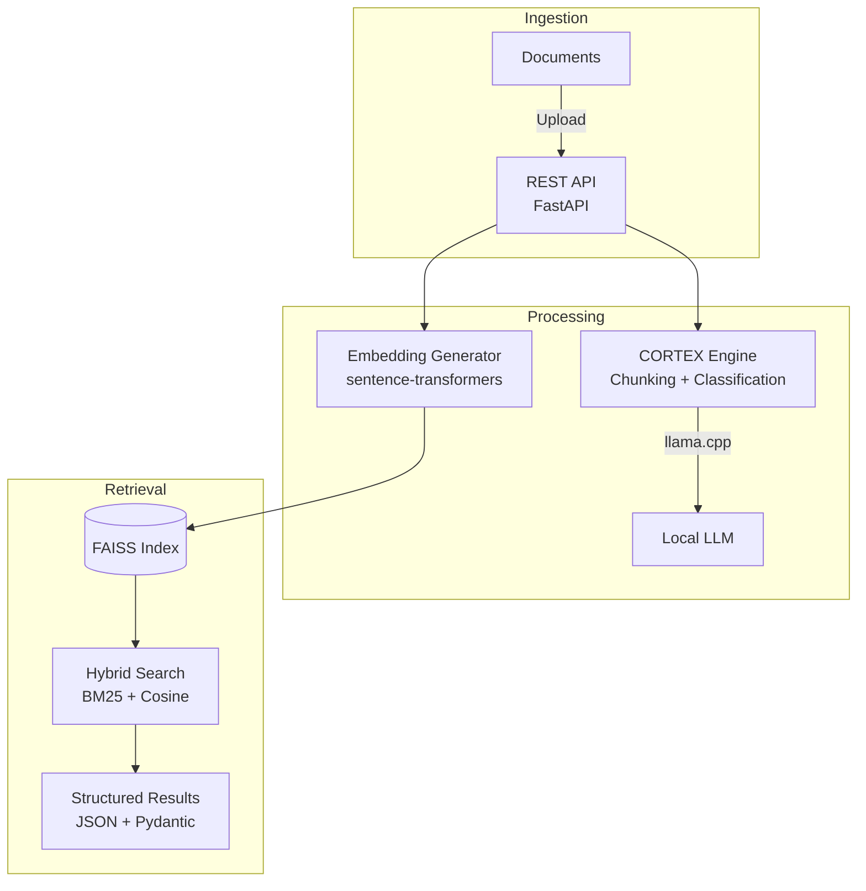

# Executive Summary

## Overview

Phantom is a document intelligence framework that processes unstructured files (markdown, text, PDF) into structured, searchable data. It combines semantic chunking, local LLM classification (via llama.cpp), and FAISS vector indexing into a single pipeline exposed through a REST API.

The project has two runtime components:

- **Phantom Core** (Python) — document processing, NLP, vector search, REST API
- **IntelAgent** (Rust) — agent infrastructure with security, governance, and memory modules

## Architecture

The system is organized into three layers: ingestion, processing, and retrieval.

## Components

### Phantom Core (Python)

Handles document processing and serves the REST API.

- **CORTEX Engine**: semantic chunking (tiktoken), parallel LLM classification, insight extraction
- **RAG Pipeline**: FAISS vector store with hybrid search (BM25 + cosine via Reciprocal Rank Fusion)
- **Analysis**: sentiment scoring (NLTK VADER), named entity extraction (SPECTRE)
- **API**: FastAPI with Prometheus metrics, health/readiness probes, system resource monitoring
- **Pipeline**: PII detection and redaction, file fingerprinting (SHA-256), content routing by type

### IntelAgent (Rust)

Multi-crate workspace providing agent infrastructure. Modules include security/privacy auditing, governance, context memory, quality gates, and MCP protocol handling. Builds with Crane (Nix) and Tokio for async execution.

### Cortex Desktop (Tauri + SvelteKit)

Desktop interface with tabs for RAG chat, document processing, vector search, and prompt workbench. Framework is in place; UI components are minimal. See the [Roadmap](../README.md#roadmap) for current status.

## Technology Stack

| Component | Technology | Purpose |
|-----------|-----------|---------|
| Backend | Python 3.11+, FastAPI | API, document processing, ML pipeline |
| Agent | Rust, Tokio, Crane | Security, governance, memory modules |
| Desktop | Tauri 2, SvelteKit | Cross-platform desktop UI |
| Vector Store | FAISS, sentence-transformers | Embedding generation and similarity search |
| LLM Inference | llama.cpp | Local model serving (OpenAI-compatible API) |
| Build/Dev | Nix Flakes, Just | Reproducible environment, task automation |
| CI/CD | GitHub Actions | Lint, test, security scan, CodeQL, SBOM |

## Data Flow

1. **Upload**: user submits a document via API or CLI
2. **Chunking**: CORTEX splits text into semantic chunks (configurable size/overlap)
3. **Classification**: each chunk is sent to llama.cpp for parallel LLM classification
4. **Embedding**: sentence-transformers generates vector embeddings per chunk
5. **Indexing**: embeddings are stored in FAISS for retrieval
6. **Query**: users search the index via dense, sparse (BM25), or hybrid modes

## Platform Support

| Platform | Status |
|----------|--------|
| Linux (x86_64) | Supported (Nix, pip) |
| macOS (Apple Silicon / Intel) | Supported (Nix, pip) |
| Windows | Untested (pip — should work) |

Standalone binaries for Linux and macOS are planned.

## License

Apache License 2.0 — see [LICENSE](../LICENSE).
